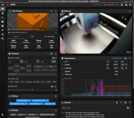
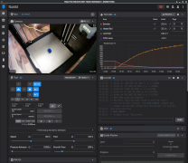
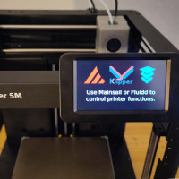
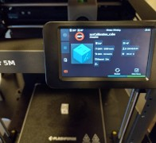

# Klipper Mod for Flashforge Adventurer 5M (Pro)

This is an *unofficial* mod to run Moonraker, custom Klipper, Mainsail & Fluidd on the Flashforge AD5M (Pro) 3D printers and unlock the full power of open source software.

Klipper Mod for the AD5M is designed to be fully removable and not break any functions of the stock software.

> [!CAUTION]
> *If you want to install this mod to your AD5M (Pro) then be aware, that you risk to loose your warranty or damage the printer. Proceed at your own risk if you want to try this mod!*

*This mod is currently in beta stage.* Many features are implemented already but they need to be tested thoroughly and polished a bit by early adopters.

## Feature Overview

- [Klipper](https://www.klipper3d.org/) 0.11 ‒ with improved configuration and default macros
- [Moonraker](https://github.com/Arksine/moonraker) on port 7125
- [Mainsail](https://docs.mainsail.xyz/) on port 4000
- [Fluidd](https://docs.fluidd.xyz/) on port 4001
- [KlipperScreen](https://klipperscreen.readthedocs.io/en/latest/) ‒ separate  build variant
- [Guppyscreen](https://github.com/ballaswag/guppyscreen) ‒ separate preview build variant
- Camera streaming via [ustreamer](https://github.com/pikvm/ustreamer) on port 8080
- [Moonraker-timelapse](https://github.com/mainsail-crew/moonraker-timelapse) support
- Network access: Ethernet LAN and WiFi via [iwd](https://iwd.wiki.kernel.org/)
- Customized Linux environment based on [Buildroot](https://buildroot.org/)
- SSH root access. Login: `root`, Password: `klipper`
- [Audio](https://pypi.org/project/ff-adm5-audio/) via buzzer (can play simple Midis)
- [LCD backlight](https://pypi.org/project/ff-ad5m-backlight/) control 
- Automatic USB flash drive mounting
- "Dual boot" with stock Flashforge software

All features of the mod run directly on the printer built-in system (Allwinner T113-S3 with 128MB RAM). No additional hardware is required. 

## Getting Started

Download test latest [Release Build](https://github.com/xblax/flashforge_ad5m_klipper_mod/releases) and read through the documentation for [Installation](docs/INSTALL.md) and [Slicing](docs/SLICING.md). Also make yourself familiar with the [Uninstall](docs/UNINSTALL.md) methods, to get rid of the mod if you don't like it.

The Klipper Mod for AD5M (Pro) is currently provided in three variants: 
- Default headless variant without an on-screen GUI control application
- Beta Klipper Screen variant with fully-fledged [KlipperScreen](docs/KLIPPER_SCREEN.md) installation. If you encounter any issues that could be caused by resource exhaustion (mostly system RAM), please check if the issue also occurs with the default variant.
- Alpha Guppy Screen variant for a more ligthweight UI on the limited hardwareof the 5m/5mpro. If you encounter any issues that could be caused by resource exhaustion (mostly system RAM), please check if the issue also occurs with the default variant.

You are welcome to participate int the [GitHub Discussions](https://github.com/xblax/flashforge_ad5m_klipper_mod/discussions) or open a new [Issue](https://github.com/xblax/flashforge_ad5m_klipper_mod/issues) if you find any bugs.

## Documentation

Due to the beta stage of Klipper Mod the documentation is not fully-completed. The documentation is split into several topics:

- [Install](docs/INSTALL.md): How to install Klipper Mod
- [Uninstall](docs/UNINSTALL.md): Uninstall Klipper Mod
- [Slicing](docs/SLICING.md): Configure your Slicer for Klipper
- [Wifi](docs/WIFI.md): Methods to Configure WiFi
- [Linux Environment](docs/LINUX.md): Klipper Mod Linux environment
- [Klipper Screen](docs/KLIPPER_SCREEN.md)
- [Guppy Screen](docs/GUPPY_SCREEN.md)
- [Camera](docs/CAMERA.md)
- [USB](docs/USB.md)
- [LCD](docs/LCD.md)
- [Buzzer](docs/BUZZER.md)
- [Build Instructions](docs/BUILDING.md)
